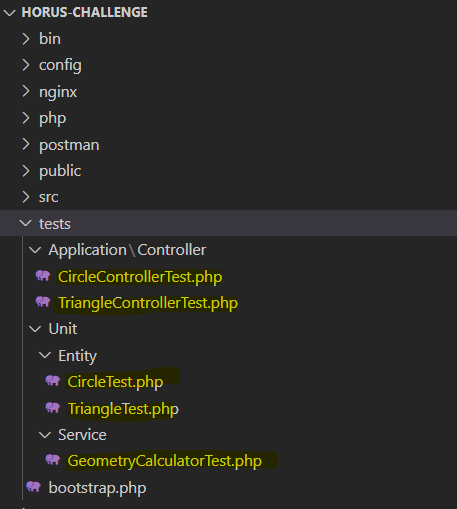
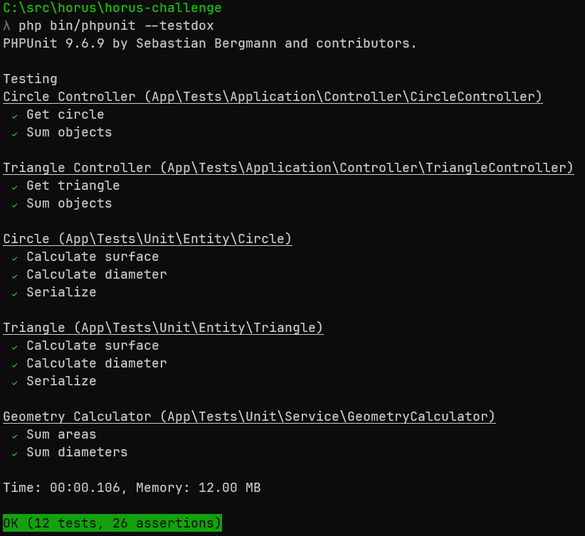

# Cristhian García Challenge for Horus

## Deploy

### Cloning the Repository

To clone the repository from GitHub, you can follow these instructions:

1. Open your terminal or command prompt.

2. Navigate to the directory where you want to clone the repository. For example, if you want to clone it into your "Documents" folder, you can use the following command:

   ```
   cd Documents
   ```

3. Run the following command to clone the repository:

   ```
   git clone https://github.com/crisgarlez/horus-challenge.git
   ```

   This command will initiate the cloning process and download the repository files to your current directory.

4. Wait for the cloning process to complete. Once it's finished, you should see a new directory named "horus-challenge" in your current location.

5. You have successfully cloned the repository! You can now navigate into the cloned directory using the following command:

   ```
   cd horus-challenge
   ```

### Using Docker to deploy on local environment

To build Docker images for the repository using the docker-compose.yml file provided inside the horus-challenge folder, you can follow these instructions:

1. Ensure that you have Docker and Docker Compose installed on your machine. You can download and install Docker from the official Docker website (https://www.docker.com/get-started), and Docker Compose is typically included with Docker on most platforms.

2. Open your terminal or command prompt.

3. Inside the `horus-challenge` directory, you should find a `docker-compose.yml` file.

4. Run the following command to build the Docker images defined in the `docker-compose.yml` file:

   ```bash
   docker-compose build
   ```

   This command will read the `docker-compose.yml` file and build the necessary Docker images specified in the file.

5. Wait for the images to be built. The time it takes to build the images may vary depending on the complexity of the project and the resources of your machine.

6. Once the images have been built successfully, you can proceed to run the containers based on the images using the `docker-compose up` command. Run the following command:

   ```bash
   docker-compose up
   ```

   This command will start the containers according to the configurations specified in the `docker-compose.yml` file.

   Note: If you want to run the containers in detached mode (in the background), you can add the `-d` flag:

   ```bash
   docker-compose up -d
   ```

7. The containers should now be running, and you can access the services provided by the application.

### Using Postman to do HTTP Request

#### Importing the Postman collection

To import the Postman collection located in the `postman/HorusChallenge.postman_collection.json` file, you can follow these instructions:

1. Make sure you have Postman installed on your machine. You can download and install Postman from the official Postman website (https://www.postman.com/downloads/).

2. Open Postman and ensure you are in the Postman workspace where you want to import the collection.

3. In the Postman application, click on the "Import" button in the top left corner of the screen.

4. In the Import dialog, select the "File" tab.

5. Click on the "Upload Files" button and navigate to the location where you have cloned the repository.

6. Inside the cloned repository, locate the `postman` folder and open it.

7. Select the `HorusChallenge.postman_collection.json` file.

8. Click the "Open" or "Choose" button to start the import process.

9. Postman will import the collection and display a confirmation message once the import is complete.

10. You should now see the imported collection in the left sidebar of the Postman application.

11. Click on the imported collection to expand it and view the available requests and folders.

You have successfully imported the Postman collection into Postman. You can now use the collection to make requests to the API endpoints provided by the Horus Challenge application.

Please note that the instructions may vary slightly depending on the version of Postman you are using.

#### API Methods

##### circle Endpoint

```console
GET /circle/2
HTTP/1.1
Host: localhost

Response:
{
    "surface": "12.57",
    "circumference": "12.57",
    "type": "circle",
    "radius": "2.0"
}
```

##### triangle Endpoint

```console
GET /triangle/3/4/5
HTTP/1.1
Host: localhost

Response:
{
    "surface": "6.0",
    "circumference": "12.0",
    "type": "triangle",
    "a": "3.0",
    "b": "4.0",
    "c": "5.0"
}
```

##### circle-sum Endpoint

```console
POST /circle/sum-objects
HTTP/1.1
Host: localhost
Content-Type: application/json

Body:

{
    "circle1": {
        "radius": 2
    },
    "circle2": {
        "radius": 2
    }
}

Response

{
    "totalAreas": 25.14,
    "totalDiameters": 8
}
```

##### triangle-sum Endpoint

```console
POST /triangle/sum-objects
HTTP/1.1
Host: localhost
Content-Type: application/json
Content-Length: 159

{
    "triangle1": {
        "a": 3,
        "b": 4,
        "c": 5
    },
    "triangle2": {
        "a": 3,
        "b": 4,
        "c": 5
    }
}

Response

{
    "totalAreas": 12,
    "totalDiameters": 24
}
```

## Project Explaniation

Shape Entity Class:

```php
<?php

namespace App\Entity;

abstract class Shape
{
    abstract public function calculateSurface(): float;
    abstract public function calculateDiameter(): float;

    public function calculateSurfaceAndDiameter(): array
    {
        $surface = $this->calculateSurface();
        $diameter = $this->calculateDiameter();

        return [
            'surface' => $surface,
            'circumference' => $diameter,
        ];
    }
}
```

- The Shape class is an abstract class that serves as the base class for all shapes.
- It declares two abstract methods: `calculateSurface()` and `calculateDiameter()`. These methods represent steps of an algorithm that subclasses must implement.
- The Shape class also provides a concrete method called `calculateSurfaceAndDiameter()`. This method acts as the template method, defining the overall algorithmic structure.
- The `calculateSurfaceAndDiameter()` method calls the abstract methods `calculateSurface()` and `calculateDiameter()` to calculate the surface area and diameter of the shape, respectively.
- The method returns an array containing the calculated surface area and diameter.

Circle Entity Class:

```php
<?php

namespace App\Entity;

use App\Entity\Shape;

class Circle extends Shape
{
    private $radius;

    public function __construct(float $radius)
    {
        $this->radius = $radius;
    }

    public function calculateSurface(): float
    {
        return round(pi() * ($this->radius ** 2), 2);
    }

    public function calculateDiameter(): float
    {
        return $this->radius * 2;
    }

    public function serialize(): array
    {
        $result = $this->calculateSurfaceAndDiameter();
        $result['type'] = 'circle';
        $result['radius'] = number_format($this->radius, 1, ".", "");
        $result['circumference'] = number_format($result['surface'], 2, ".", "");
        $result['surface'] = number_format($result['surface'], 2, ".", "");

        return $result;
    }
}
```

- The Circle class extends the Shape class, inheriting the template method and implementing the abstract methods.
- It has a private property called `$radius` to store the radius of the circle.
- The class implements the `calculateSurface()` method, which calculates the surface area of the circle using the formula π \* radius^2.
- It also implements the `calculateDiameter()` method, which calculates the diameter of the circle by multiplying the radius by 2.
- Additionally, the Circle class provides a `serialize()` method, which converts the Circle object into an array with serialized properties, including the type, radius, surface, and circumference.

Triangle Entity Class:

```php
<?php

namespace App\Entity;

use App\Entity\Shape;

class Triangle extends Shape
{
    private $a;
    private $b;
    private $c;

    public function __construct(float $a, float $b, float $c)
    {
        $this->a = $a;
        $this->b = $b;
        $this->c = $c;
    }

    public function calculateSurface(): float
    {
        $s = ($this->a + $this->b + $this->c) / 2;
        return round(sqrt($s * ($s - $this->a) * ($s - $this->b) * ($s - $this->c)), 2);
    }

    public function calculateDiameter(): float
    {
        return $this->a + $this->b + $this->c;
    }

    public function serialize(): array
    {
        $result = $this->calculateSurfaceAndDiameter();
        $result['type'] = 'triangle';
        $result['a'] = number_format($this->a, 1, ".", "");
        $result['b'] = number_format($this->b, 1, ".", "");
        $result['c'] = number_format($this->c, 1, ".", "");
        $result['circumference'] = number_format($result['circumference'], 1, ".", "");
        $result['surface'] = number_format($result['surface'], 1, ".", "");

        return $result;
    }
}
```

- The Triangle class, similar to the Circle class, extends the Shape class and implements the abstract methods.
- It has three private properties: `$a`, `$b`, and `$c`, representing the lengths of the triangle's sides.
- The class implements the `calculateSurface()` method, which calculates the surface area of the triangle using Heron's formula.
- The `calculateDiameter()` method calculates the diameter of the triangle by summing up all three side lengths.
- Similarly to the Circle class, the Triangle class provides a `serialize()` method to convert the Triangle object into an array with serialized properties, including the type, side lengths (a, b, c), surface, and circumference.

**Template Method Pattern:**

- The Template Method pattern is implemented in the Shape class and its subclasses (Circle and Triangle).
- The Shape class defines the overall algorithmic structure through the `calculateSurfaceAndDiameter()` template method.
- The abstract methods `calculateSurface()` and `calculateDiameter()` act as "hooks" that subclasses must implement to provide specific calculations for their respective shapes.
- The template method calls these abstract methods, allowing each subclass to customize the behavior of those specific steps.
- This approach promotes code reuse and provides a common structure for calculating the surface area and diameter of different shapes.

GeometryCalculator.php Service Class

```php
<?php

namespace App\Service;

use App\Entity\Shape;

class GeometryCalculator
{
    public function sumAreas(Shape $shape1, Shape $shape2): float
    {
        $area1 = $shape1->calculateSurface();
        $area2 = $shape2->calculateSurface();

        return $area1 + $area2;
    }

    public function sumDiameters(Shape $shape1, Shape $shape2): float
    {
        $diameter1 = $shape1->calculateDiameter();
        $diameter2 = $shape2->calculateDiameter();

        return $diameter1 + $diameter2;
    }
}
```

The `GeometryCalculator` class is a service class that provides methods for calculating the sum of areas and sum of diameters for two given shapes.

Let's break down the class and its methods:

1. `sumAreas(Shape $shape1, Shape $shape2): float`:

   - This method takes two `Shape` objects, `$shape1` and `$shape2`, as input parameters.
   - It calls the `calculateSurface()` method on each shape object to calculate their respective surface areas.
   - The calculated surface areas are then added together and returned as a float value representing the sum of areas.

2. `sumDiameters(Shape $shape1, Shape $shape2): float`:
   - This method takes two `Shape` objects, `$shape1` and `$shape2`, as input parameters.
   - It calls the `calculateDiameter()` method on each shape object to calculate their respective diameters.
   - The calculated diameters are then added together and returned as a float value representing the sum of diameters.

The `GeometryCalculator` class operates on the abstraction of the `Shape` class. This allows it to work with any subclass of `Shape`, such as `Circle` or `Triangle`, as long as they implement the required methods (`calculateSurface()` and `calculateDiameter()`).

By encapsulating the logic for calculating the sum of areas and sum of diameters in a separate service class, the `GeometryCalculator` promotes separation of concerns and keeps the code organized. It also allows for easy extension and flexibility if additional shape types or calculations need to be added in the future.

CircleController.php Controller class

```php
<?php

namespace App\Controller;

use Symfony\Bundle\FrameworkBundle\Controller\AbstractController;
use Symfony\Component\Routing\Annotation\Route;
use Symfony\Component\HttpFoundation\JsonResponse;
use Symfony\Component\HttpFoundation\Request;

use App\Entity\Circle;
use App\Service\GeometryCalculator;

class CircleController extends AbstractController
{
    #[Route('/circle/{radius}', methods: ["GET"], name: 'app_circle')]
    public function index(float $radius): JsonResponse
    {
        $circle = new Circle($radius);
        return $this->json($circle->serialize());
    }

    #[Route('/circle/sum-objects', methods: ["POST"], name: 'app_circle_sum_object')]
    public function sumObjects(Request $request, GeometryCalculator $geometryCalculator): JsonResponse
    {
        $payload = json_decode($request->getContent(), TRUE);
        $circle1 = new Circle($payload['circle1']['radius']);
        $circle2 = new Circle($payload['circle2']['radius']);

        return $this->json([
            'totalAreas' => $geometryCalculator->sumAreas($circle1, $circle2),
            'totalDiameters' => $geometryCalculator->sumDiameters($circle1, $circle2)
        ]);
    }
}
```

The `CircleController` class is a Symfony controller that handles HTTP requests related to circles. Let's go through the code and understand its functionality:

1. `index(float $radius): JsonResponse`:

   - This method is mapped to the route `/circle/{radius}` with the HTTP method `GET`.
   - It expects a `float` parameter `$radius` to be passed in the URL.
   - Inside the method, a new `Circle` object is created using the provided `$radius`.
   - The `serialize()` method of the `Circle` object is called, which returns an array containing information about the circle.
   - The array is then converted to a JSON response using the `json()` method of the `AbstractController` class and returned.

2. `sumObjects(Request $request, GeometryCalculator $geometryCalculator): JsonResponse`:
   - This method is mapped to the route `/circle/sum-objects` with the HTTP method `POST`.
   - It expects a `Request` object and a `GeometryCalculator` object to be passed as dependencies.
   - The request payload is decoded from JSON format using the `json_decode()` function with the second argument set to `true`, which returns an associative array.
   - Two `Circle` objects are created using the radius values extracted from the payload.
   - The `sumAreas()` and `sumDiameters()` methods of the `GeometryCalculator` service are called, passing the two circle objects as arguments.
   - The results of the calculations, the total areas and total diameters, are returned as a JSON response.

The `CircleController` class follows the Symfony controller convention, utilizing annotations for route mapping. It uses the `Circle` entity class to create circle objects and the `GeometryCalculator` service to perform calculations on those objects.

TriangleController.php Controller class

```php
<?php

namespace App\Controller;

use Symfony\Bundle\FrameworkBundle\Controller\AbstractController;
use Symfony\Component\Routing\Annotation\Route;
use Symfony\Component\HttpFoundation\Request;
use Symfony\Component\HttpFoundation\JsonResponse;

use App\Service\GeometryCalculator;
use App\Entity\Triangle;

class TriangleController extends AbstractController
{
    #[Route('/triangle/{a}/{b}/{c}', methods: ["GET"], name: 'app_triangle')]
    public function index(float $a, float $b, float $c): JsonResponse
    {
        $triangle = new Triangle($a, $b, $c);
        return $this->json($triangle->serialize());
    }

    #[Route('/triangle/sum-objects', methods: ["POST"], name: 'app_triangle_sum_object')]
    public function sumObjects(Request $request, GeometryCalculator $geometryCalculator): JsonResponse
    {
        $payload = json_decode($request->getContent(), TRUE);

        $triangle1 = $payload['triangle1'];
        $triangle1 = new Triangle($triangle1['a'], $triangle1['b'], $triangle1['c']);

        $triangle2 = $payload['triangle2'];
        $triangle2 = new Triangle($triangle2['a'], $triangle2['b'], $triangle2['c']);

        return $this->json([
            'totalAreas' => $geometryCalculator->sumAreas($triangle1, $triangle2),
            'totalDiameters' => $geometryCalculator->sumDiameters($triangle1, $triangle2)
        ]);
    }
}
```

The `TriangleController` class is another Symfony controller that handles HTTP requests related to triangles. Let's understand the code and its functionality:

1. `index(float $a, float $b, float $c): JsonResponse`:

   - This method is mapped to the route `/triangle/{a}/{b}/{c}` with the HTTP method `GET`.
   - It expects three `float` parameters `$a`, `$b`, and `$c` to be passed in the URL representing the sides of the triangle.
   - Inside the method, a new `Triangle` object is created using the provided side lengths.
   - The `serialize()` method of the `Triangle` object is called, which returns an array containing information about the triangle.
   - The array is then converted to a JSON response using the `json()` method of the `AbstractController` class and returned.

2. `sumObjects(Request $request, GeometryCalculator $geometryCalculator): JsonResponse`:
   - This method is mapped to the route `/triangle/sum-objects` with the HTTP method `POST`.
   - It expects a `Request` object and a `GeometryCalculator` object to be passed as dependencies.
   - The request payload is decoded from JSON format using the `json_decode()` function with the second argument set to `true`, which returns an associative array.
   - Two sets of triangle side lengths are extracted from the payload.
   - Two `Triangle` objects are created using the side lengths extracted from the payload.
   - The `sumAreas()` and `sumDiameters()` methods of the `GeometryCalculator` service are called, passing the two triangle objects as arguments.
   - The results of the calculations, the total areas and total diameters, are returned as a JSON response.

The `TriangleController` class follows the Symfony controller convention and utilizes annotations for route mapping. It uses the `Triangle` entity class to create triangle objects and the `GeometryCalculator` service to perform calculations on those objects.

## Tests

The tests are organized into separate test files, each containing test cases for specific classes or features. These test files follow the naming convention of <ClassName>Test.php to indicate the class being tested.



### Running the Tests

To execute the tests, you can use PHPUnit, a popular testing framework for PHP. Make sure PHPUnit is installed either globally or as a development dependency in your project.

To run all the tests, open a terminal, navigate to the root directory of your project, and execute the following command:

`php bin/phpunit --testdox`


